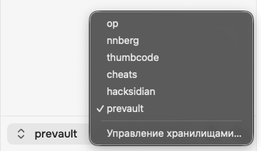
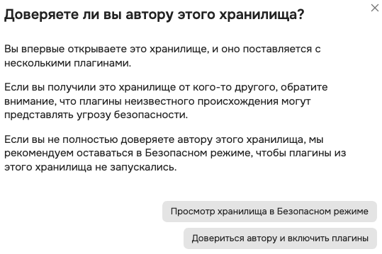

# Как установить vault (хранилище)

> [!WARNING]
> **У вас уже установлен сам [Obsidian](https://www.obsidian.md)**? 
> Если ещё нет — пора.

## Сам vault
Никакие программы устанавливать не нужно. А нужно вот что.
1. **Скачать [последнюю версию](https://github.com/nnberg-com/prevault/releases/latest).** Технически это архив, то есть zip-файл. У него есть [версии](https://github.com/nnberg-com/prevault/releases) (release) — вам нужна последняя. Все версии (release) живут в GitHub-репозитории  [nnberg-com/prevault](https://github.com/nnberg-com/prevault). `Репозиторий` → `Realeases` → `prevault-[какие-то циферки].zip` — так всегда на GitHub, и тут тоже.
2. **Распаковать архив на свой компьютер.** Куда вам удобно. Там он будет жить всегда, так что выбирайте место, которым постоянно пользуетесь. В архиве каталог — он-то и будет вашим vault (хранилищем).
3. **Открыть vault в Obsidian.** Сначала попадите в окно управления хранилищами — одним из двух способов:
    1. Верхнее меню → `File` → `Open Vault`
    2. Выпадайка в левом нижнем углу → `Управление хранилищами…`

После этого — `Открыть папку как хранилище` → кнопка `«Открыть»`. Покажет такую картинку — нажимайте «Довериться автору и включить плагины»:
   

**Всё.** Вы в своём новом хранилище (vault). Можно его обживать.

> [!TIP]
> **С чего начать?** Если хотите, конечно.
> 1. Создайте заметку в дереве слева.
> 2. С помощью подсказки `_help` → `ru` → `Как тут писать текст` что-нибудь попишите в этой заметке.
> 3. Привыкните нажимать `⌘ E` (переключение между режимами редактирования и просмотра) и `⌘ ,` (настройки).
> 
> **Вы великолепны!** Создавайте новые заметки, пишите что попало. Дальше оно само.

## Шрифты
Для полной красоты пригодятся бесплатные шрифты:
- [Onest](https://fonts.google.com/specimen/Onest)
- [MesloLGS Nerd Font Mono](https://www.nerdfonts.com/font-downloads) (на странице называется MesloLG Nerd Font)

Скачайте их и установите на свой компьютер. Этого можно и не делать — просто тогда ваш Obsidian будет выглядеть пострашней.

## Иконка приложения

Не нравится фиолетовая иконка приложения? Её можно поменять средствами вашей операционной системы.

Зеленовато-жёлтая иконка уже тут — в каталоге [_media/icon](_media/icon).

А если хотите сделать свою — делайте через [конструктор на сайте Obsidian](https://obsidian.md/ru/blog/new-obsidian-icon/).
